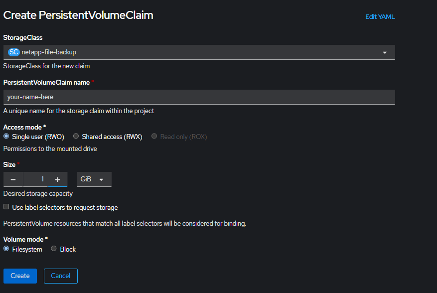

# How to deploy backup container using Helm and config file 

## Reference: 
- [backup-container](https://github.com/BCDevOps/backup-container?tab=readme-ov-file#deploy-with-helm-chart) we refer to this for instructions on how to deploy
- [helm charts](https://github.com/bcgov/helm-charts/tree/master/charts/backup-storage)
- [installing helm](https://helm.sh/docs/intro/install/)

```
oc login --web //logs you into openshift
helm repo add bcgov http://bcgov.github.io/helm-charts //install the charts
```

Navigate to the config.yaml configuration folder 
```
helm upgrade --install backup-patroni bcgov/backup-storage -n <<NAMESPACE>> -f <<CONFIG LOCATION>>

example: 
helm upgrade --install backup-patroni bcgov/backup-storage -n 75e61b-dev -f config.yaml
```

Notes: 

- One of the errors I had while backing up was 
    - to fix, I updated the tag on the config.yaml to be the latest offered by bcDevops/backup-container 2.9.0 at the time of writing this readme. 


> pg_dump: error: server version: 15.6 (Ubuntu 15.6-1.pgdg22.04+1); pg_dump version: 14.7
pg_dump: error: aborting because of server version mismatch

    

- unable to find persistence volume claim 
    - to fix had to create a persistence volume claim matching what was set in the config.yaml file. 


- how do I verify that the backups work? 
    - I rsynced into the pods and downloaded the .gz backups and opened them in dbeaver. 