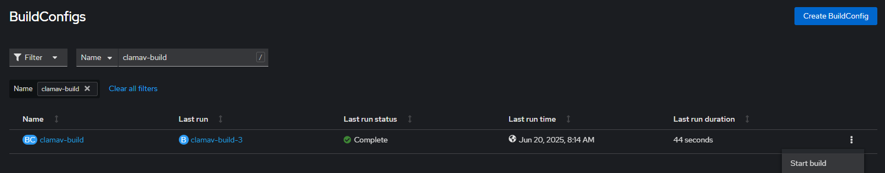

## Cloned from https://github.com/bcgov/clamav with edits to the code to match our needs. 

ClamAV® is an open source antivirus engine for detecting trojans, viruses, malware & other malicious threats.

This is a repo setup for utilization in Red Hat Openshift.  This solution allows you to create a pod in your openshift environment to scan any file for known virus signatures, quickly and effectively.

The builds package the barebones service, and the deployment config will download latest signatures on first run.

Freshclam can be run within the container at any time to update the existing signatures.  Alternatively, you can re-deploy which will fetch the latest into the running container.

# Deployment

The templates in the [openshift/templates](./openshift/templates) will build and deploy the app.  Modify to suit your own environment.  [openshift/templates/clamav-bc.conf](./openshift/templates/clamav-bc.conf) will create your builder image (ideally in your tools project), and [openshift/templates/clamav-dc.conf](./openshift/templates/clamav-dc.conf) will create the pod deployment.  Modify the environment variables defined in both the build config and deployment config appropriately.

## Deploy with Helm

The Helm chart deploys a standard StatefulSet. This deployment should work on [OpenShift Local](https://github.com/crc-org/crc), [kind](https://kind.sigs.k8s.io/) or even [Docker Desktop](https://docs.docker.com/desktop/kubernetes/)

Requirements: 
* helm client installed https://helm.sh/docs/intro/install/ 
* oc cli client installed (you should be able to find this on openshift under command line tools) https://console.apps.silver.devops.gov.bc.ca/command-line-tools
* assumes you built the image using the clamav-bc.conf and tagged it to the appropriate version

1. **CLI** Navigate to the clamav folder in this repository 
2. **CLI** log into openshift 
```
oc login --web 
OR 
copy paste oc login token from openshift
```
3. **EDITOR** Adjust the values.yaml to match the image tag in tools namespace below is a snippet from the values.yaml file.
```
clamav:
  # clamav.image -- The clamav docker image
  image: image-registry.openshift-image-registry.svc:5000/75e61b-tools/clamav
  tag: <<ADJUST TAG IMAGE>>
```
4. **CLI** run helm upgrade command in the proper namespace **make sure you are in the proper location in the clam av folder**

template
```
helm upgrade --install -n <namespace>-<env> clamav ./charts/clamav -f ./charts/clamav/values.yaml
```
example
```
helm upgrade --install -n 75e61b-dev clamav ./charts/clamav -f ./charts/clamav/values.yaml
```

## How to upgrade the image

1. **WEB** run the build config again to build a new latest image on openshift https://console.apps.silver.devops.gov.bc.ca/k8s/ns/75e61b-tools/build.openshift.io~v1~BuildConfig?name=clamav-build

2. **CLI** tag latest clamav image to the next version ex. 1.0.3 etc. 
```
 oc tag 75e61b-tools/clamav:latest 75e61b-tools/clamav:<version>
```
3. follow the steps to deploy via helm above while changing the clam image version number to match version. 

## Issues
* if the clamAV version is greater than 1.0.6 we get an error in the docker image. source: https://github.com/Cisco-Talos/clamav/issues/1371 I ended up just using the 1.0.5 image and tested with a fake virus file from https://www.eicar.org/download-anti-malware-testfile/ to confirm our image still works. 
